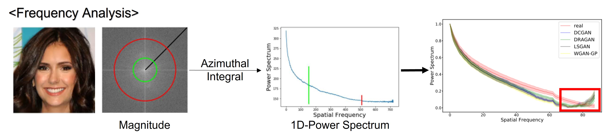
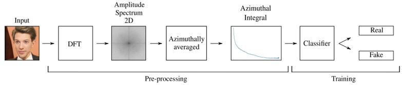
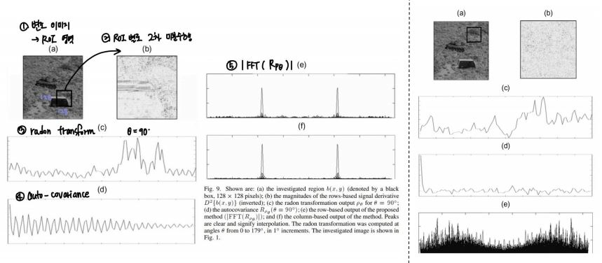

# Image forgery detection in frequency domain

## Fourier Transform

## Related Work

- [Watch your Up-Convolution: CNN Based Generative Deep Neural Networks are Failing to Reproduce Spectral Distributions (CVPR 2020)](https://openaccess.thecvf.com/content_CVPR_2020/html/Durall_Watch_Your_Up-Convolution_CNN_Based_Generative_Deep_Neural_Networks_Are_CVPR_2020_paper.html)
	- [논문리뷰](https://github.com/Sang-Yeong/Research/blob/master/watch_your_up_conv.pdf)
	- [Azimuth Integral 구현](https://github.com/Sang-Yeong/Research/blob/master/Azimuth_integral.ipynb)

<ul><ul>

(사진출처: https://www.youtube.com/watch?v=rlpqO6v9J8k)

- GAN, AE 와 같은 생성석 신경망의 경우, Up-Convolution 기법 사용
- Up-Convolution이 적용된 이미지 --> FFT변환 --> Azimuthal Integral을 통해 1차원 신호로 살펴봄
- <U>**스펙트럼 왜곡**</U>이 발생한다는 사실 발견

- 스펙트럼 왜곡을 통해 up-conv가 적용된 이미지 판별 가능

</ul></ul>

- [Blind Authentication Using Periodic Properties of Interpolation(IEEE Transactions on Information Forensics and Security 2008)](https://ieeexplore.ieee.org/abstract/document/4540058)
	- [논문리뷰](https://github.com/Sang-Yeong/Research/blob/master/hand_crafted_image_forgery_detction.pdf)
	- [논문구현](https://github.com/Sang-Yeong/Research/blob/master/mahdian_estimator.ipynb)

<ul><ul>

- Idea: interpolated signals & their derivatives --> 감지 가능한 <U>**특정 주기 속성**</U> 존재
- Method
	1. ROI selection
	2. Signal derivative computation
	3. Radon Transformation
	4. Search for periodicity; autocovariance, fft

</ul></ul>

