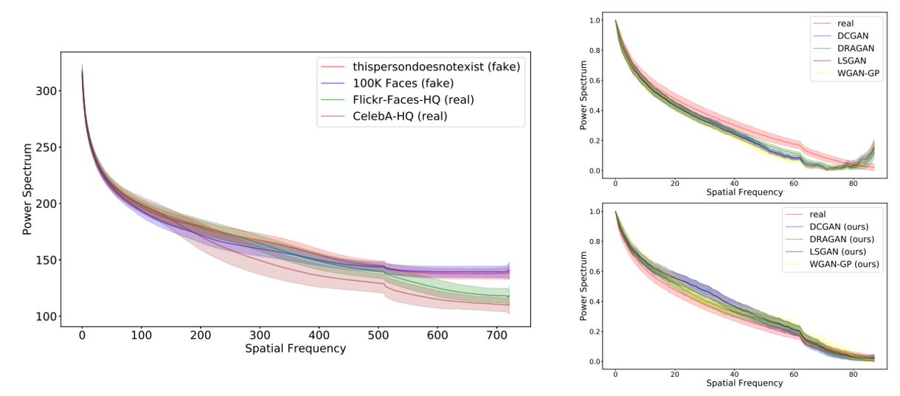
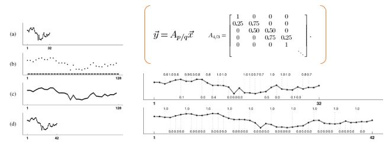
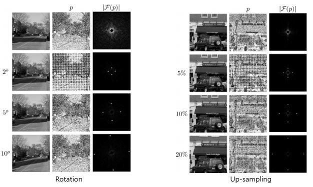

# Image forgery detection

## Research Keyword
> Watch your Up-Convolution: CNN Based Generative Deep Neural Networks are Failing to Reproduce Spectral Distributions (CVPR 2020)
> https://openaccess.thecvf.com/content_CVPR_2020/html/Durall_Watch_Your_Up-Convolution_CNN_Based_Generative_Deep_Neural_Networks_Are_CVPR_2020_paper.html

- [Watch your Up-Convolution 정리](https://github.com/Sang-Yeong/Research/blob/master/watch_your_up_conv.pdf)
- [Azimuth Integral 구현](https://github.com/Sang-Yeong/Research/blob/master/Azimuth_integral.ipynb)
- Idea
	- GAN, AE 와 같은 생성석 신경망; Up-Convolution 기법 사용
		- 보간을 이용한 up-conv
		- 전치된 conv
    - Up-Conv이 **스펙트럼 왜곡을 유발**한다는 사실 발견 --> 딥페이크 검출기 제안
    - 스펙트럼 왜곡을 보정할 수 있는 Spectral Reularization 제안
    	- --> GAN 모델 안정화 & 시각적 출력 품질 향상

- Keyword
	1. Sampling method
	2. Frequency domain
	3. Fourier Transform
	4. Azimuth Integral

## Related Work
#### hand crafted method
[hand crafted method 논문 정리](https://github.com/Sang-Yeong/Research/blob/master/hand_crafted_image_forgery_detction.pdf)

> Exposing digital forgeries by detecting traces of resampling(IEEE Transactions on Signal Processing 2005)
> https://ieeexplore.ieee.org/document/1381775

- Idea
	- 이미지 위조 --> 이미지의 기본 통계 변화 분석
	- 이웃 픽셀과의 상관성을 갖는 주기적 samples를 찾음으로써 detect가능

- Resampling signals

- Resampling Images

---

> Blind Authentication Using Periodic Properties of Interpolation(IEEE Transactions on Information Forensics and Security 2008)
> https://ieeexplore.ieee.org/document/4540058

- [Blind Authentication Using Periodic Properties of Interpolation 구현](https://github.com/Sang-Yeong/Research/blob/master/mahdian_estimator.ipynb)

- Idea: interpolated signals & their derivatives ← 감지 가능한 **특정 주기 속성** 존재
- Method
	1. ROI selection
	2. Signal derivative computation
	3. Radon Transformation
	4. Search for periodicity; autocovariance, fft

---

> Effective Estimation of Image Rotation Angle Using Spectral Method (IEEE Signal Processing Letters 2014)
> https://ieeexplore.ieee.org/document/6805599
> https://github.com/ChenglongChen/image-rotation-angle-estimation

- Idea
	- 이미지 회전 각도를 추정하는 blind and effective method 제안
	- 2차 통계의 2차원 스펙트럼을 사용하여 회전된 이미지의 숨겨진 주기성을 활용하여 작동

- 연구 실험결과 확인

